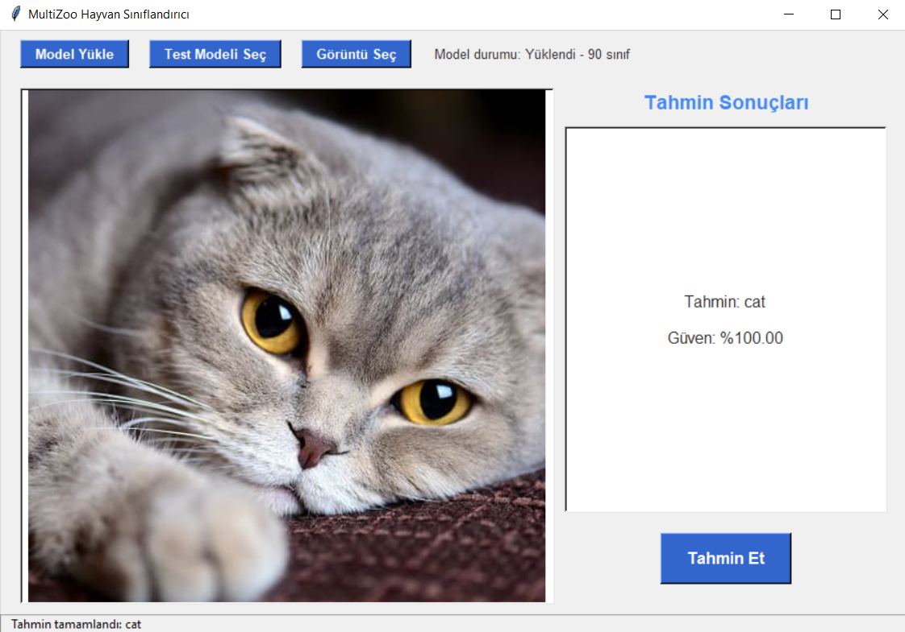
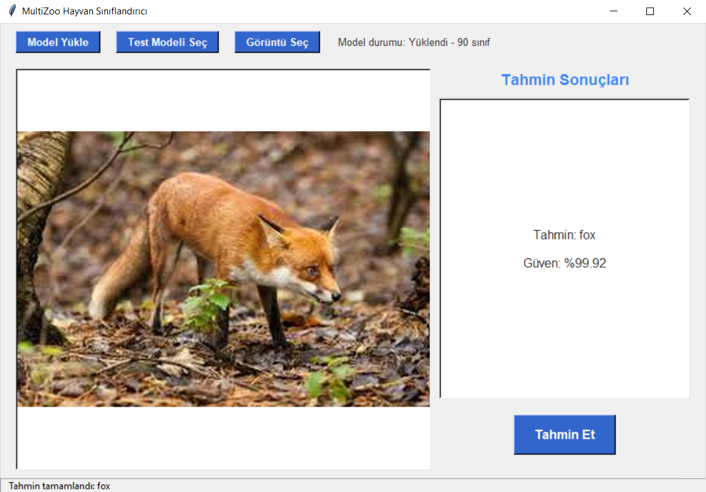
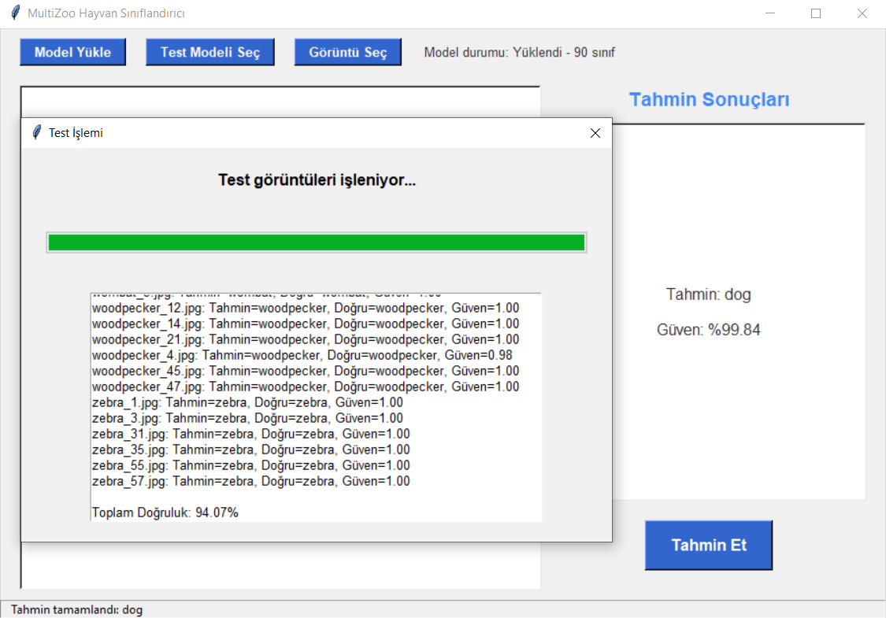

# MultiZoo: Hayvanlar İçin Görüntü Sınıflandırması 🐱🐕


Bu proje, Transformer tabanlı derin öğrenme modelleri kullanarak hayvan görüntülerini sınıflandıran kapsamlı bir sistem sunar. Vision Transformer (ViT), Swin Transformer ve DeiT modellerini destekler ve kullanıcı dostu bir grafik arayüz ile birlikte gelir.

## 🎯 Proje Özellikleri

- **90 farklı hayvan türü** sınıflandırması
- **3 farklı Transformer modeli** desteği (ViT, Swin, DeiT)
- **Grafik kullanıcı arayüzü** (GUI) ile kolay kullanım
- **Toplu test** özelliği ile model performans değerlendirmesi
- **Görselleştirme** araçları (öğrenme eğrileri, karmaşıklık matrisi)
- **%95.07 doğruluk** oranına ulaşan model performansı

### 📸 Ekran Görüntüleri

#### 🐱 Kedi Sınıflandırma Örneği


#### 🐕 Köpek Sınıflandırma Örneği


#### 🦊 Tilki Sınıflandırma Örneği


#### 🧪 Test Arayüzü


## 📊 Model Performansı

En son eğitilen ViT modelinin doğrulama seti üzerindeki performansı:

- **Doğruluk (Accuracy):** 95.07%
- **Kesinlik (Precision):** 95.50%
- **Duyarlılık (Recall):** 95.07%
- **F1-Skor:** 95.08%
- **Eğitim Süresi:** 35.7 dakika

## 🏗️ Proje Yapısı

```
multi-zoo/
├── gui.py                 # Grafik kullanıcı arayüzü
├── model.py              # Transformer model tanımları
├── train.py              # Model eğitim scripti
├── utils.py              # Yardımcı fonksiyonlar
├── results/              # Eğitim sonuçları ve grafikler
│   ├── confusion_matrix.png
│   ├── learning_curves_*.png
│   └── results.txt
└── README.md
```

## 🚀 Kurulum

### Gereksinimler

```bash
pip install torch torchvision
pip install timm
pip install scikit-learn
pip install matplotlib seaborn
pip install Pillow
pip install tqdm
pip install tkinter  # Çoğu Python kurulumunda varsayılan olarak gelir
```

### Veri Seti Hazırlığı

Eğitim verilerinizi aşağıdaki yapıda organize edin:

```
train/
├── aslan/
│   ├── resim1.jpg
│   ├── resim2.jpg
│   └── ...
├── kaplan/
│   ├── resim1.jpg
│   └── ...
└── ...
```

## 💻 Kullanım

### 1. Model Eğitimi

```bash
python train.py --train_dir path/to/train --model_type vit --epochs 15 --batch_size 32
```

**Parametreler:**
- `--train_dir`: Eğitim verilerinin bulunduğu dizin
- `--model_type`: Model türü (`vit`, `swin`, `deit`)
- `--epochs`: Eğitim epoch sayısı (varsayılan: 15)
- `--batch_size`: Batch boyutu (varsayılan: 32)
- `--lr`: Öğrenme oranı (varsayılan: 0.00005)
- `--val_size`: Doğrulama seti oranı (varsayılan: 0.2)
- `--early_stopping`: Erken durdurma sabır sayısı (varsayılan: 10)

### 2. GUI Uygulaması

```bash
python gui.py
```

**GUI Özellikleri:**
- **Model Yükleme:** Eğitilmiş model dosyasını yükleyin (.pt formatı)
- **Tek Görüntü Sınıflandırma:** Bir görüntü seçin ve tahmin alın
- **Toplu Test:** Klasör dolusu görüntüyü test edin ve doğruluk oranını hesaplayın
- **Güven Skoru:** Her tahmin için güven yüzdesini görün

## 🧠 Desteklenen Modeller

### 1. Vision Transformer (ViT)
- **Model:** `vit_base_patch16_224`
- **Özellik:** Görüntüyü patch'lere bölerek işler
- **Avantaj:** Uzun menzilli bağımlılıkları iyi yakalar

### 2. Swin Transformer
- **Model:** `swin_base_patch4_window7_224`
- **Özellik:** Hiyerarşik window-based yaklaşım
- **Avantaj:** Farklı ölçeklerdeki özellikleri etkili bir şekilde yakalar

### 3. DeiT (Data-efficient image Transformer)
- **Model:** `deit_base_patch16_224`
- **Özellik:** Veri-etkin öğrenme
- **Avantaj:** Daha az veri ile iyi performans

## 📈 Eğitim Özellikleri

### Veri Augmentasyonu
- Rastgele yatay ve dikey çevirme
- Rastgele döndürme (15°)
- Renk değişimleri (brightness, contrast, saturation, hue)
- Rastgele yeniden boyutlandırma ve kırpma
- Rastgele afin dönüşümler
- Rastgele perspektif değişimleri

### Optimizasyon
- **Optimizer:** AdamW
- **Scheduler:** ReduceLROnPlateau
- **Loss Function:** CrossEntropyLoss
- **Early Stopping:** Doğrulama performansına göre

### Metrikler
- Doğruluk (Accuracy)
- Kesinlik (Precision)
- Duyarlılık (Recall)
- F1-Skor
- Karmaşıklık Matrisi

## 📊 Görselleştirmeler

Eğitim sırasında otomatik olarak oluşturulan grafikler:

1. **Öğrenme Eğrileri:**
   - `learning_curves_loss.png` - Kayıp fonksiyonu eğrisi
   - `learning_curves_accuracy.png` - Doğruluk eğrisi
   - `learning_curves_precision.png` - Kesinlik eğrisi
   - `learning_curves_recall.png` - Duyarlılık eğrisi
   - `learning_curves_f1.png` - F1-skor eğrisi

2. **Karmaşıklık Matrisi:**
   - `confusion_matrix.png` - Sınıflar arası karışıklık analizi

## 🔧 Teknik Detaylar

### Model Mimarisi
- **Input Size:** 224x224 RGB görüntüler
- **Normalizasyon:** ImageNet ortalaması ve standart sapması
- **Pre-trained:** ImageNet üzerinde önceden eğitilmiş modeller
- **Fine-tuning:** Son katman 90 sınıf için uyarlanmış

### Performans Optimizasyonları
- **GPU Desteği:** CUDA kullanılabilir durumdaysa otomatik olarak kullanılır
- **Batch Processing:** Verimli batch işleme
- **Memory Management:** Gradyan hesaplamaları sırasında bellek optimizasyonu

## 📄 Lisans

Bu proje açık kaynak lisansı altında dağıtılmaktadır.

## 🙏 Teşekkürler

- **Hugging Face Transformers** - Transformer model implementasyonları
- **timm** - Pytorch image model kütüphanesi
- **scikit-learn** - Metrik hesaplamaları
- **matplotlib & seaborn** - Görselleştirme araçları

---

⭐ Bu projeyi beğendiyseniz yıldız vermeyi unutmayın!